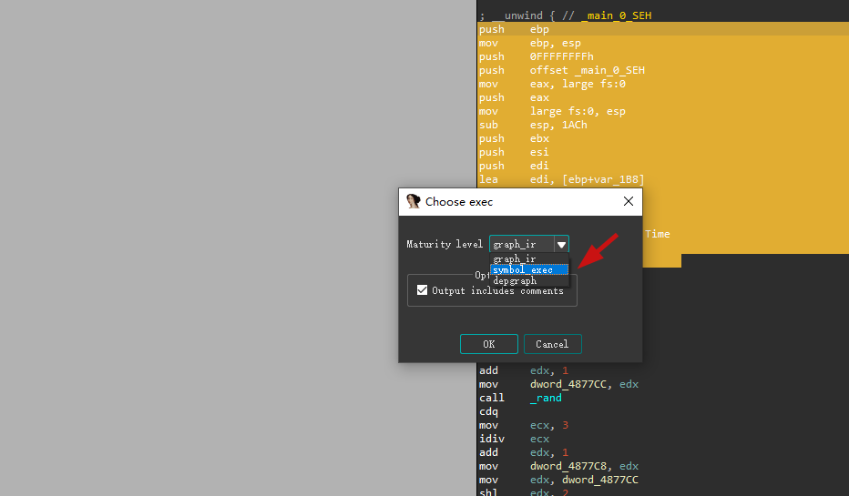

Miasm
========

This is a IDA plugin that integrates several modules of miasm

Installation
========

Before installing this plugin,you should install the miasm module.
And then copying file `MiasmPlugin.py` and directory `miasm_modules` into IDA's `plugins` directory

USAGE
=======

For example:

symbol execution

**1.First step

Select an area

**2.Second step

Click the symbol_exec

Origin
=======

These code come from the modification of miasm module
